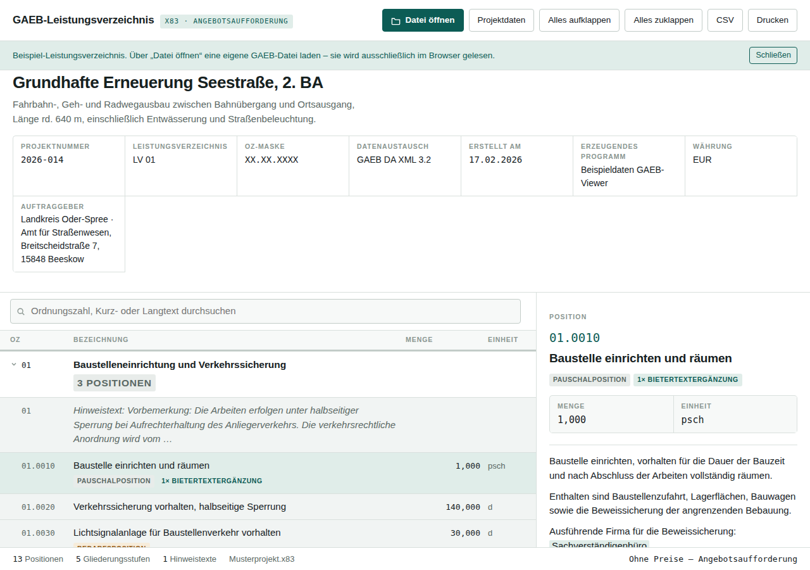

# GAEB-X83-Viewer

Ein Leistungsverzeichnis im GAEB-Format im Browser lesen – ohne Installation,
ohne Server, ohne dass die Datei den eigenen Rechner verlässt.



## Starten

`index.html` mit einem Doppelklick im Browser öffnen. Das war alles – die Seite
läuft vollständig lokal (`file://`), es wird nichts hochgeladen.

Eine GAEB-Datei lädt man über **Datei öffnen** oder indem man sie irgendwo auf
das Fenster zieht. Beim Start ist ein Beispiel-Leistungsverzeichnis geladen,
damit sofort sichtbar ist, was das Programm kann.

Dieselbe Oberfläche liegt zusätzlich als veröffentlichte Seite bereit –
praktisch, wenn das Repository gerade nicht zur Hand ist:
<https://claude.ai/code/artifact/0e26482b-12d5-4c95-b603-4e95dc626424>.
Dort reicht der CSV-Export die Datei über den Speichern-Dialog des Betrachters
weiter, weil die eingebettete Seite keine eigenen Downloads starten darf.

## Was gelesen wird

* **GAEB DA XML 3.x** in allen Austauschphasen – X81 bis X89. Der Schwerpunkt
  liegt auf **X83 (Angebotsaufforderung)**; X84/X86 werden mit Einheits- und
  Gesamtpreisen samt Angebotssumme angezeigt.
* Dateien mit UTF-8 oder ISO-8859-1, mit und ohne Namensraum-Präfixe.
* GAEB-Dateien, die in einem ZIP-Archiv stecken, werden direkt entpackt.
* **Nicht** unterstützt: die alten Formate GAEB 90 (`.d83`) und GAEB 2000
  (`.p83`) – das sind keine XML-Dateien und bräuchten einen eigenen Parser.

## Was angezeigt wird

* Projekt-, Vergabe- und Auftraggeberdaten als Deckblatt
* die vollständige LV-Hierarchie (Lose, Titel, Untertitel) zum Auf- und Zuklappen
* Ordnungszahl, Kurztext, Menge, Einheit und – falls vorhanden – Preise
* der Langtext jeder Position mit Fett-/Kursiv-Auszeichnung und hervorgehobenen
  **Bietertextergänzungen**
* Positionsarten als Kennzeichnung: Bedarfsposition, Grund- und
  Alternativposition, Pauschalposition, Stundenlohnarbeit, Wiederholungsposition
* Hinweis- und Vorbemerkungstexte an ihrer Stelle im LV

## Bedienung

| Aktion | Weg |
| --- | --- |
| Suchen | Suchfeld oder Taste `/` – durchsucht OZ, Kurz- und Langtext |
| Position öffnen | Zeile anklicken oder mit `↑`/`↓` und `Enter` ansteuern |
| Gliederung auf/zu | Pfeil-Symbol anklicken oder `→`/`←` |
| Detailansicht schließen | `Esc` |
| Nach Excel | **CSV** – Semikolon-getrennt, zusätzlich in der Zwischenablage |
| Papierfassung | **Drucken** – druckt die sichtbare Gliederung ohne Bedienelemente |

## Dateien

| Datei | Inhalt |
| --- | --- |
| `index.html` | Oberfläche, Gestaltung und Bedienlogik |
| `gaeb.js` | Parser für GAEB DA XML, ZIP-Entpackung, Encoding-Erkennung |
| `beispiel/Musterprojekt.x83` | Beispiel-LV (Straßenbau), auch in `index.html` eingebettet |
| `tools/embed-beispiel.sh` | überträgt die Beispieldatei in den eingebetteten Startdatensatz |
| `tools/build.sh` | erzeugt die verteilbaren Fassungen unter `dist/` |

Das Beispiel steckt zusätzlich direkt in `index.html`, weil ein Browser unter
`file://` keine Nachbardatei nachladen darf. Nach einer Änderung an
`beispiel/Musterprojekt.x83` gleicht `tools/embed-beispiel.sh` beides wieder an.

## Fassungen erzeugen

```
tools/build.sh
```

legt unter `dist/` drei Fassungen ab:

| Ergebnis | Zweck |
| --- | --- |
| `dist/gaeb/` | Webserver, zwei Dateien – die übliche Wahl |
| `dist/gaeb-eine-datei/` | Webserver, alles in einer `index.html` |
| `dist/GAEB-Viewer.html` | dieselbe Einzeldatei, sprechend benannt für den Versand |

Für den Webserver den Inhalt des gewünschten Ordners per FTP hochladen, etwa
nach `htdocs/gaeb/` – dann ist der Viewer unter `https://<domain>/gaeb/`
erreichbar.

Alle erzeugten Fassungen starten mit leerer Ablagefläche; das Beispiel-LV ist
dort über einen Knopf erreichbar. Nur die Quelldatei `index.html` selbst öffnet
mit dem Beispiel, gesteuert über `data-start="beispiel"` am Element `.app` –
praktisch beim Entwickeln und für eine Vorführung.

Die mitgelieferte `.htaccess` setzt die Zeichenkodierung auf UTF-8 – ohne sie
liefern manche Apache-Konfigurationen ISO-8859-1 im HTTP-Header aus, was das
`<meta charset>` der Seite überstimmt und Umlaute zerstört.

Gesteuert wird der Startzustand über das Attribut `data-start` am Element
`.app`: `beispiel` lädt das Muster-LV, jeder andere Wert beginnt leer.

## Einsatz im Firmennetz

Die Seite lädt nichts nach: keine Schriften, keine Bibliotheken, keine
Telemetrie. Sie funktioniert offline und ohne Internetzugang, und die geöffnete
GAEB-Datei verlässt den Rechner nicht – relevant, solange Vergabeunterlagen vor
dem Submissionstermin vertraulich sind.

Für eine Einbindung in SharePoint Online genügt es **nicht**, die Datei in eine
Dokumentbibliothek zu legen: SharePoint rendert dort abgelegtes HTML nicht als
Seite. Der tragfähige Weg ist ein SPFx-Webpart aus dem App-Katalog; der Parser
`gaeb.js` lässt sich dafür unverändert übernehmen.

## Grenzen

Der Viewer zeigt an, er rechnet nicht: Mengenermittlungen (REB-Ansätze),
Zuschlagskalkulationen und Preisanteile (`UPComps`) bleiben unberücksichtigt.
Preise werden nur dargestellt, wenn sie in der Datei stehen.
